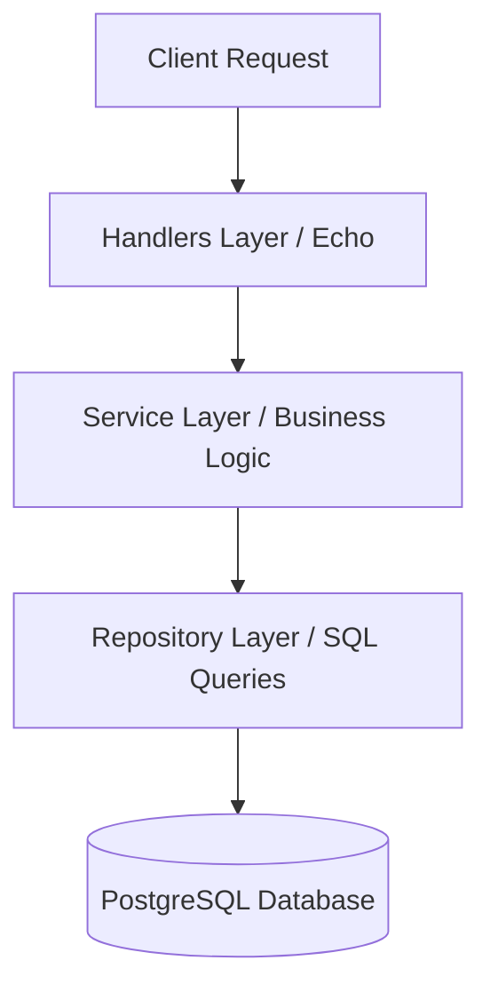
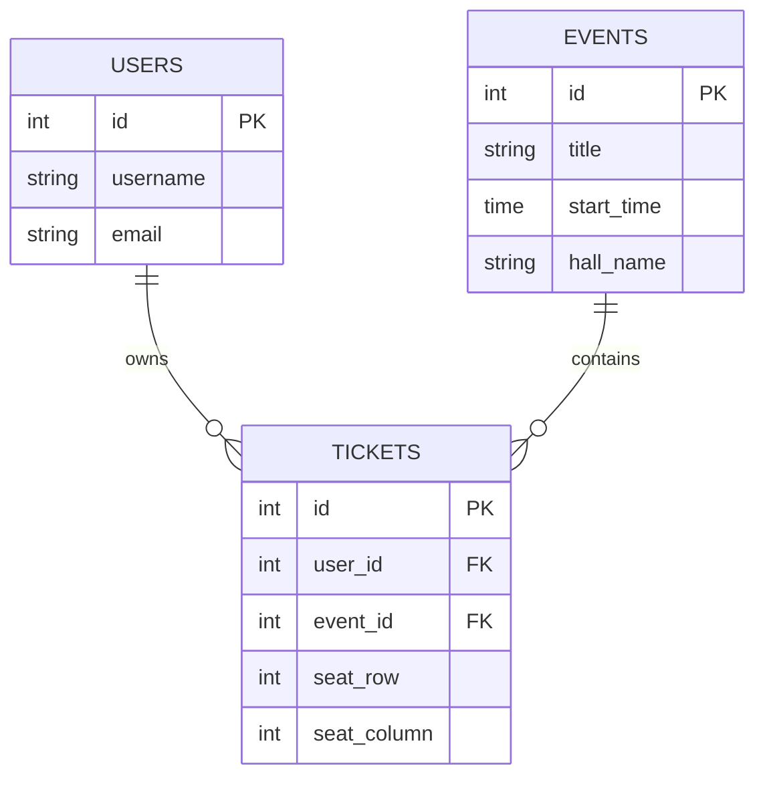

# 🎟️ Ticket Booking API


A high-performance, production-grade RESTful API service for event scheduling and ticket booking built with **Go (Echo framework)** and **PostgreSQL**. Designed with **Clean Architecture** (Handler-Service-Repository pattern) and optimized for high concurrency using `pgxpool` connection management.

---

## 📸 Preview

<details>
<summary><b>Click to expand screenshots</b></summary>
<br>

<p align="center">
  
  <br><i>Telegram Bot UI & Bookings Overview</i><br><br>
  
  <br><i>PostgreSQL Relations & Records</i><br><br>
  
  <br><i>Terminal & Request Processing</i>
</p>
</details>

---

## 🛠 Tech Stack

| Component | Technology | Description |
| :--- | :--- | :--- |
| **Language** | [Go](https://go.dev/) | High-concurrency backend language |
| **Framework** | [Echo v4](https://echo.labstack.com/) | Fast, minimalist Go web framework |
| **Database** | [PostgreSQL 16](https://www.postgresql.org/) | Relational database for ACID compliance |
| **Database Driver** | [pgx / pgxpool](https://github.com/jackc/pgx) | High-performance PostgreSQL driver and connection pool |
| **Containerization** | [Docker & Compose](https://www.docker.com/) | One-command local environment setup |

---

## 🏗 Architecture & System Design

The service follows **Layered Clean Architecture** to isolate HTTP delivery, business domain rules, and data persistence:



### Database Entity Relationship Diagram (ERD)



---

## 📡 API Endpoints Reference

### 🎬 Events API

| Method | Endpoint | Description | Status Code |
| :--- | :--- | :--- | :--- |
| `GET` | `/events` | Retrieve all upcoming events | `200 OK` |
| `GET` | `/events/:id` | Get detailed information for an event | `200 OK` / `404 Not Found` |
| `POST` | `/events` | Create a new event | `201 Created` |
| `PUT` | `/events/:id` | Update an existing event | `200 OK` / `400 Bad Request` |
| `DELETE` | `/events/:id` | Delete an event by ID | `200 OK` / `404 Not Found` |

### 🎟️ Bookings API

| Method | Endpoint | Description | Status Code |
| :--- | :--- | :--- | :--- |
| `POST` | `/users` | Register a new user | `201 Created` |
| `POST` | `/tickets` | Reserve a seat/ticket for an event | `201 Created` |
| `GET` | `/users/:id/tickets` | List all tickets owned by a specific user | `200 OK` |

---

## 🚀 Getting Started

### Prerequisites

* [Docker Desktop](https://www.docker.com/products/docker-desktop/) (recommended)
* [Go 1.22+](https://go.dev/dl/) (optional, for local execution)
* [PostgreSQL 16](https://www.postgresql.org/) (optional)

---

### Environment Setup

Create a `.env` file in the project root directory:

```env
SERVER_PORT=8080
DB_HOST=postgres
DB_PORT=5432
DB_USER=postgres
DB_PASSWORD=secret
DB_NAME=ticket_db
```

---

### Option 1: Quick Launch with Docker Compose (Recommended)

Run the API service and PostgreSQL database simultaneously:

```bash
# 1. Clone repository
git clone https://github.com/KirillS13/Barbershop_TgBot.git
cd Barbershop_TgBot

# 2. Build and launch containers
docker compose up -d --build

# 3. Check application logs
docker compose logs -f app
```

---

### Option 2: Native Local Launch

```bash
# 1. Download Go module dependencies
go mod download

# 2. Run application
go run main.go
```

---

## 📌 Roadmap

- [ ] JWT Authentication & Middleware
- [ ] Database Transactions (`BEGIN ... COMMIT`) for concurrent seat reservation
- [ ] Schema migration management via `golang-migrate`
- [ ] TTL Auto-cleanup worker for expired bookings
